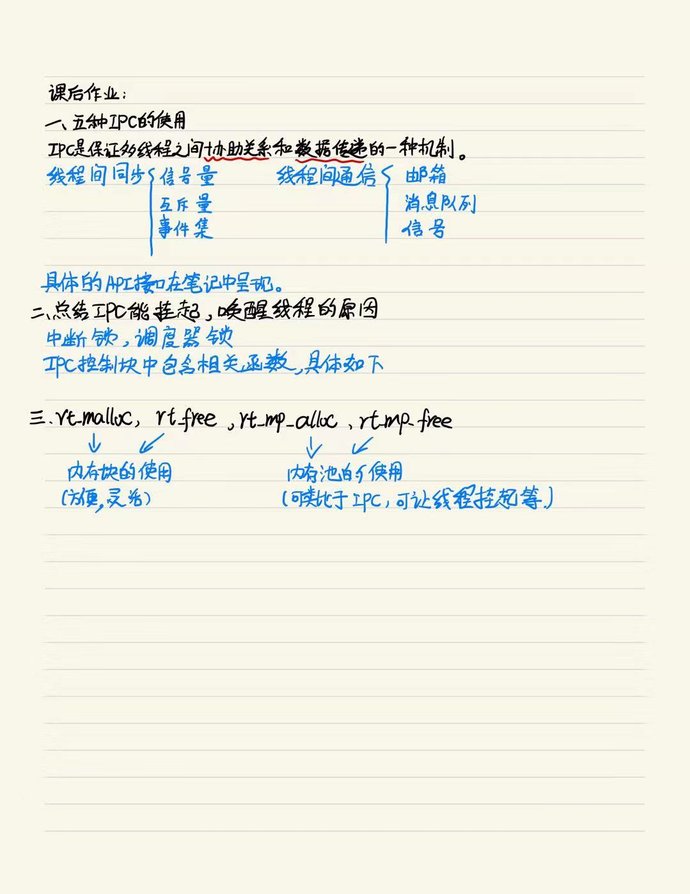

中断锁：

关闭中断也叫中断锁，是禁止多任务访问临界区最简单的一种方式，即使是在分时操作系统中也是如此。当中断关闭的时候，就意味着当前任务不会被其他事件打断（因为整个系统已经不再响应那些可以触发线程重新调度的外部事件），也就是当前线程不会被抢占，除非这个任务主动放弃了处理器控制权。

关闭中断/恢复中断API接口由BSP实现，根据平台的不同其实现方式也大不相同。比如在stm32平台中中断锁机制通过关闭中断函数（rt_base_t rt_hw_interrupt_disable(void)，这个函数用于关闭中断并返回关闭中断前的中断状态。）以及恢复中断函数（void rt_hw_interrupt_enable(rt_base_t level)，恢复调用rt_hw_interrupt_disable()函数前的中断状态）实现。
    
警告: 由于关闭中断会导致整个系统不能响应外部中断，所以在使用关闭中断做为互斥访问临界区的手段时，首先必须需要保证关闭中断的时间非常短，例如数条机器指令。

调度器锁：

同中断锁一样把调度器锁住也能让当前运行的任务不被换出，直到调度器解锁。但和中断锁有一点不相同的是，对调度器上锁，系统依然能响应外部中断，中断服务例程依然能进行相应的响应。所以在使用调度器上锁的方式进行任务同步时，需要考虑好任务访问的临界资源是否会被中断服务例程所修改，如果可能会被修改，那么将不适合采用此种方式进行同步。在rt-therad系统中通过上锁函数（void rt_enter_critical(void)，在系统锁住调度器的期间，系统依然响应中断，如果中断唤醒了的更高优先级线程，调度器并不会立刻执行它，直到调用解锁调度器函数才尝试进行下一次调度。）以及解锁函数（void rt_exit_critical(void)，当系统退出临界区的时候，系统会计算当前是否有更高优先级的线程就绪，如果有比当前线程更高优先级的线程就绪，将切换到这个高优先级线程中执行；如果无更高优先级线程就绪，将继续执行当前任务。）实现调度锁机制。

注意： rt_enter_critical/rt_exit_critical可以多次嵌套调用，但每调用一次rt_enter_critical就必须相对应地调用一次rt_exit_critical退出操作，嵌套的最大深度是65535。

IPC控制块：rt_thread/include/rtdef.h

struct rt_ipc_object
{
    struct rt_object parent;                            /**< inherit from rt_object */

    rt_list_t        suspend_thread;                    /**< threads pended on this resource */

};

rt_inline rt_err_t _ipc_object_init(struct rt_ipc_object *ipc)
{
    /* initialize ipc object */
    rt_list_init(&(**ipc->suspend_thread**)); // 初始化线程挂起链表

    return RT_EOK;

}

**rt_ipc_list_suspend将当前线程挂起**

**_ipc_list_resume**

函数rt_ipc_list_resume只会唤醒信号量中第一个挂起的线程。正常唤醒挂起线程时（如获取信号量，互斥量等）不会修改线程的error值，即error原持原值RT_EOK不变.